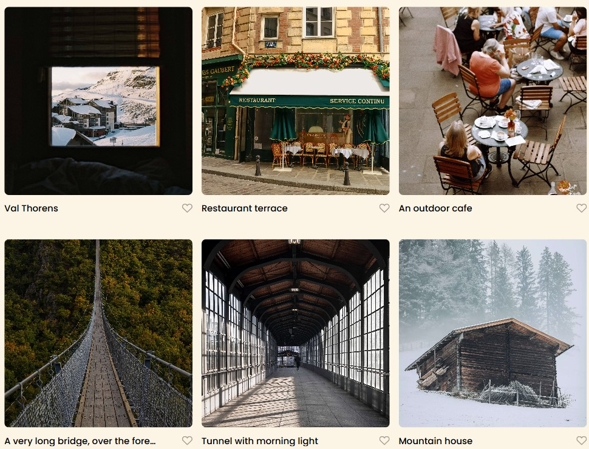

# Project 3: Spots

This is the third project of the Software Engineering program at TripleTen. It was created using HTML and CSS, based on the design brief.

**Overview**

- Intro
- Project features
- Important links
- Images
- Plan on improving the project

## Intro

This project is made so all the elements are displayed correctly on popular screen sizes.

### Project features

- HTML
- CSS
- Semantic HTML5
- Flexbox
- Positioning
- Flat BEM file structure
- Responsive design

#### Important Links

- [Link to the project on Figma](https://www.figma.com/file/BBNm2bC3lj8QQMHlnqRsga/Sprint-3-Project-%E2%80%94-Spots?type=design&node-id=2%3A60&mode=design&t=afgNFybdorZO6cQo-1)
- [Link to the project on GitHub](https://jbailey929.github.io/se_project_spots/)
- [Link to video: About Project 3 (not completed)](https://www.placeholderhtml.videonotcompletedyet)

#### Images

The images that are shown on the website were taken directly from the design brief in Figma.

##### Plan on improving the project

In the future, I believe it would be beneficial to add some active links for posting as well as some active social account links since this is meant to be a social media platform.

Thank you for viewing!
